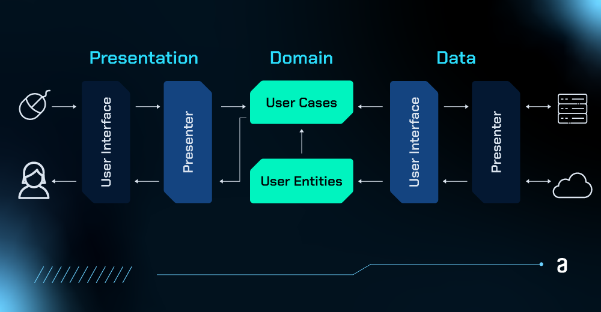
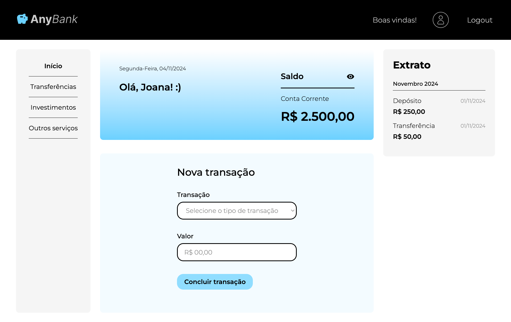

# Anybank App

Aplicação de simulação bancária para gerenciamento de transações financeiras, focada no aprendizado de conceitos de autenticação e uso do Supabase como backend. A interface permite ao usuário consultar o extrato com histórico de transações, e realizar novas transações de forma prática e intuitiva.

## 🔨 Funcionalidades do projeto

A aplicação permite:

- Cadastrar novos usuários com autenticação via Supabase.
- Cadastrar transações bancárias.
- Visualizar o histórico de transações por tipo e valor.

## ✔️ Técnicas e tecnologias utilizadas

As principais tecnologias e técnicas aplicadas no projeto são:

- **Supabase**: Backend para autenticação e armazenamento dos dados de usuários e transações.
- **React com TypeScript**: Criação da interface de usuário e lógica do aplicativo.
- **React Context API**: Gerenciamento de estados globais para autenticação.
- **React Router**: Navegação entre as diferentes páginas da aplicação.
- **Hooks personalizados**: Implementação de lógica reutilizável e controle de autenticação.

Este projeto aplica princípios de Arquitetura Limpa para promover uma estrutura modular, escalável e fácil de manter. Abaixo estão alguns dos conceitos utilizados para organizar a lógica de negócios, a manipulação de dados e a interface de forma coesa e adaptável:

- Separação de camadas: organiza o projeto em camadas distintas para facilitar a manutenção e entendimento do fluxo.
- Injeção de dependências: uso de interfaces para definir contratos entre camadas, permitindo trocas de tecnologias sem modificar a lógica central.
- Use Cases: cada caso de uso encapsula uma ação específica, mantendo a lógica de negócios isolada e coesa.
- Entidades e modelos de domínio: entidades como `IUser` e `ITransaction` representam dados centrais com regras específicas.
- Camada de infraestrutura separada: acesso a dados e integração com o Supabase são isolados, preservando a lógica de negócio.



## 📁 Acesso ao projeto

Você pode [acessar o código fonte do projeto inicial](https://github.com/alura-cursos/android-com-kotlin-personalizando-ui/tree/projeto-inicial) ou [baixá-lo](https://github.com/alura-cursos/android-com-kotlin-personalizando-ui/archive/refs/heads/projeto-inicial.zip).

## 🛠️ Abrir e rodar o projeto



Para rodar o projeto localmente, siga os passos:

1. Instale as dependências do projeto:

   ```bash
   npm install
   ```

2. Configure o [Supabase](https://supabase.com/dashboard/projects) e crie um arquivo `.env.local` com as chaves de acesso:

   ```plaintext
   SUPABASE_URL=your_supabase_url
   SUPABASE_KEY=your_supabase_key
   ```

3. Execute o projeto:
   ```bash
   npm run dev
   ```

Agora você pode acessar a aplicação em `http://localhost:5173/`.

## 📚 Mais informações do curso

Interessado em aprender mais? Confira o curso completo para desenvolver esta aplicação e entender os conceitos de forma prática!